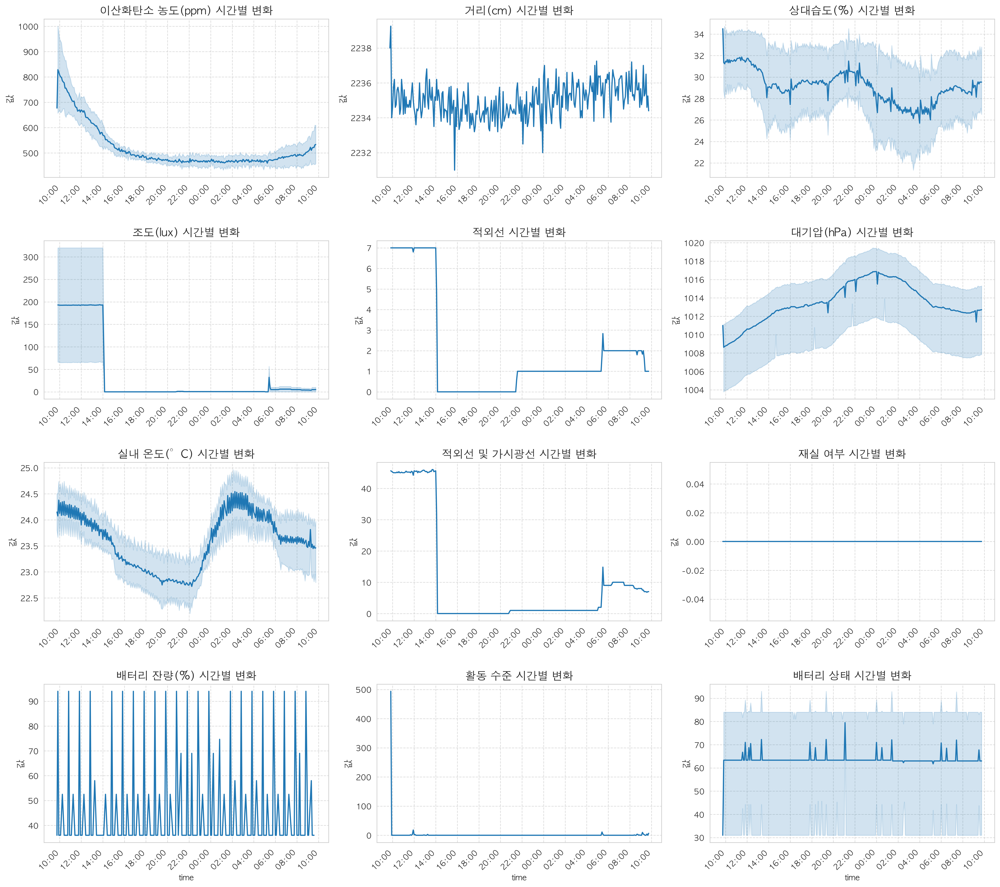

# 프로젝트 기술문서

## 4/23~

## IoT 센서 변수 정의 요약
### 환경 모니터링
- temperature: 실내 온도(°C) - 불쾌지수 계산의 핵심 요소
- humidity: 상대습도(%) - 공기 중 수분 함량
- co2: 이산화탄소 농도(ppm) - 실내 공기질 및 환기 상태 지표
- tvoc: 총휘발성유기화합물 농도(ppb) - 공기 오염도 지표
- pressure: 대기압(hPa) - 기압 변화 측정

### 재실 및 활동 감지
- occupancy: 공간 내 사람 존재 여부(0/1 또는 인원수)
- activity: 사람들의 활동 수준(움직임 강도/빈도)
- distance: 센서와 물체 간 거리(cm/m)

### 광학 센서
- illumination: 조도(lux) - 실내 빛의 강도
- infrared: 적외선 감지 - 열 방사 및 움직임 감지
- infrared_and_visible: 적외선과 가시광선 복합 감지

### 전원 관련
- battery: 센서 배터리 상태(V/mAh)
- battery_level: 배터리 잔량(%)

### 불쾌지수
- 기본 공식: 0.81×온도 + 0.01×습도×(0.99×온도-14.3) + 46.3

---

## EDA 

### EDA 1 
1. 📈 시간에 따른 변수 변화
목표: 온도, 습도, CO₂ 등의 변수들이 시간에 따라 어떻게 변화하는지 분석.
활동:

각 변수들의 시계열 분석

각 변수들의 분포 및 트렌드 확인

이상치 및 결측치 처리

통계 분석

예: 불쾌지수는 아침보다 오후에 높다, 온도는 조도와 함께 증가한다

#### 결과 