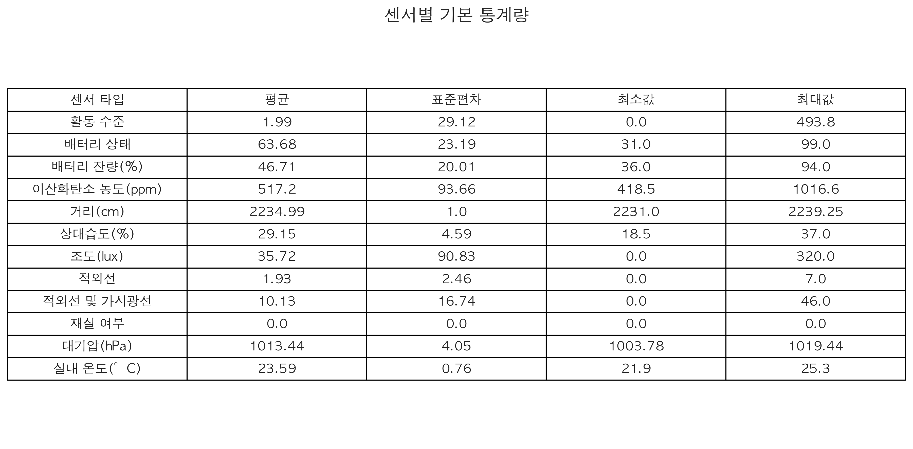

# 시간에 따른 변수 변화  


## 주요 환경 변수 기본 통계량


### 통계적 관점에서 주목할 만한 점:
- 변동성 차이: 대기압(CV=0.4%)은 매우 안정적인 반면, 조도(CV=130.3%)는 극도로 높은 변동성을 보임

이상치 가능성: 이산화탄소 농도 최대값(1468ppm)은 일반적인 실내 권장 한계(1000ppm)를 크게 초과하여 환기 개선이 필요
참고 자료 : (https://www.ehtis.or.kr/cmn/sym/mnu/mpm/111021203/htmlCnView.do)


CO₂ 농도: 아침 6-12시에 급격히 증가 (최대 1468ppm) → 환기 시스템 개선 필요

조도: 주간(12-18시) 자연광 감소 → 인공조명 사용량 증가

온도/습도: 19-24°C, 40-60% 범위 내 안정적 유지


### 최적화 알고리즘
```
def auto_ventilation(co2):
    if co2 > 1000:
        activate_fan()
        send_alert("CO₂ 위험 수준!")
```

## 결론
자동 환기 시스템 설치 필요 판단!
아침 6~12시 CO₂ 1000ppm 초과 시 자동 환기


