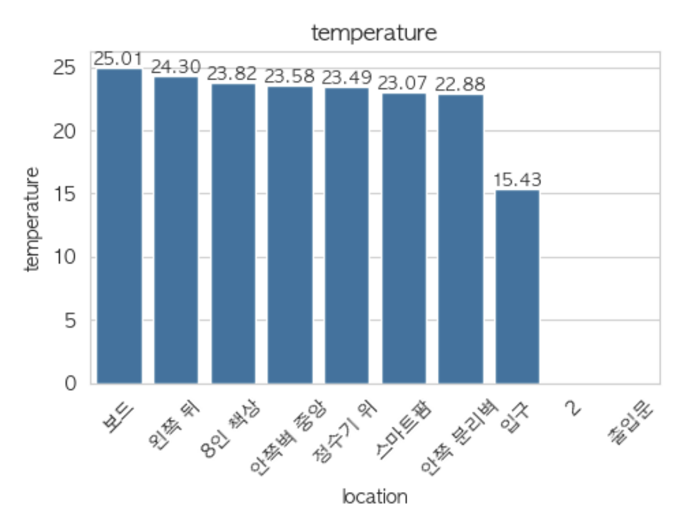
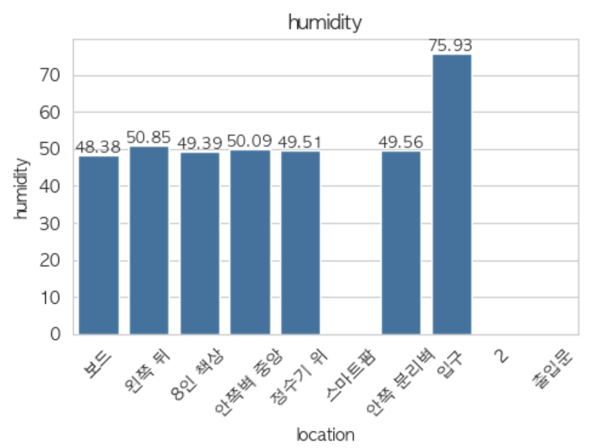
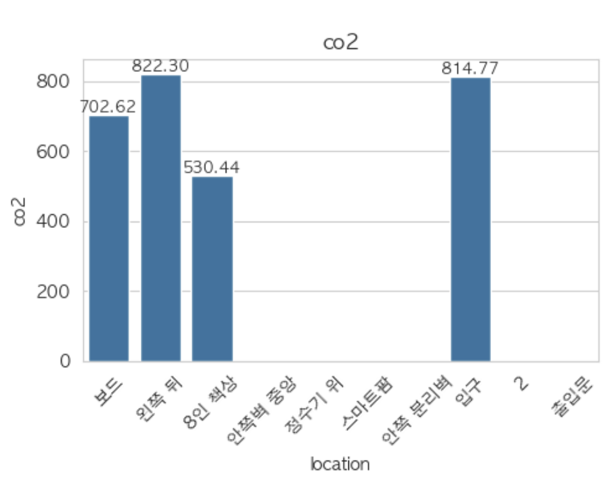
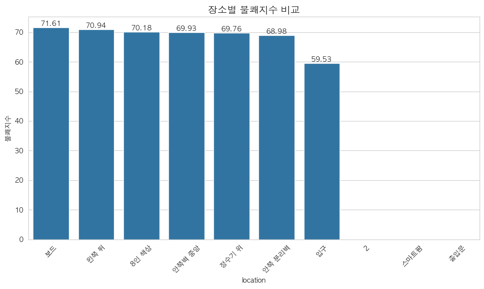

# 장소별 데이터 분석

## 장소별 환경 특성 분석
### 온도 분포

온도는 장소별로 상당한 차이를 보임
- 가장 높은 온도를 기록한 곳은 보드 주변(25.01°C)이었으며, 가장 낮은 온도는 입구 지역(15.43°C)
- 대부분의 실내 공간은 22.9°C~25.0°C 사이의 온도를 유지하고 있어 일반적인 실내 권장 온도(22~24°C) 범위에 근접하게 관리되고 있는 것으로 보임

온도 분포를 살펴보면:

25°C 이상: 보드

24°C~25°C: 왼쪽 뒤

23°C~24°C: 8인 책상, 안쪽벽 중앙, 정수기 위, 스마트팜

22°C~23°C: 안쪽 분리벽

16°C 미만: 입구

입구 지역의 온도가 현저히 낮은 것은 외부 공기 유입의 영향으로 추정

### 습도 분포

- 전반적으로 48~50% 적절한 수준으로 유지중
- 지역 "2"의 경우 습도가 높게 측정됨 

### Co2 농도 분포

- Co2 농도는 보드, 왼쪽뒤, 8인책상, 입구 4곳에서 수집됨
- 정상적인 범주
- 왼쪽뒤, 입구에서 높게 나타난편 해당 지역의 환기가 상대적으로 부족하거나 사람들의 활동이 많은 공간

### 기타 정보
- 조도 : 스마트팜이 매우 높게 나옴 식물 재배에 필요한 빛을 제공하기 위함 & 창가 위치로 시사됨

## 장소별 불쾌지수 비교

약간 불쾌함(70~75): 보드(71.61), 왼쪽 뒤(70.94), 8인 책상(70.18)

쾌적함(70 미만): 안쪽벽 중앙(69.93), 정수기 위(69.76), 스마트팜(68.98), 입구(59.53)

불쾌지수가 가장 높은 보드 주변은 온도도 가장 높았음

**추후 상관관계 분석시 참고**

---
## 장소별 특성 및 인사이트 
1. 보드 주변
특성: 가장 높은 온도(25.01°C)와 불쾌지수(71.61), 가장 낮은 습도(48.38%)

인사이트: 전자기기나 디스플레이에서 발생하는 열이 온도 상승의 원인일 수 있습니다. 냉방 시스템 보강이나 열 발생원과의 거리 조정이 필요합니다.

2. 왼쪽 뒤
특성: 두 번째로 높은 온도(24.30°C)와 불쾌지수(70.94), 높은 CO₂ 농도(822.3ppm)

인사이트: 밀폐된 공간이거나 환기가 부족한 구역일 가능성이 있습니다. 정기적인 환기나 공기순환 시스템 개선이 권장됩니다.

3. 입구
특성: 가장 낮은 온도(15.43°C)와 불쾌지수(59.53)

인사이트: 외부 공기의 직접적인 영향을 받는 공간으로, 계절에 따라 실내 온도 조절에 영향을 줄 수 있습니다. 출입구 주변 단열 강화나 에어커튼 설치를 고려할 수 있습니다.

4. '2' 지역
특성: 가장 높은 습도(75.93%), 유일하게 활동이 감지된 공간(10.38)

인사이트: 사람들의 활동이 많은 공간으로, 활동에 따른 습도 증가가 관찰됩니다. 제습기 설치나 환기 시스템 강화가 필요할 수 있습니다.

5. 스마트팜
특성: 가장 높은 조도(320lux), 적절한 온습도(23.07°C, 49.56%)

인사이트: 식물 재배에 최적화된 환경이 유지되고 있으며, 조도 수준이 식물 성장에 적합합니다.

## 단일 시점 데이터 기반이라 추후 시계열 패턴 분석 추가할 예정