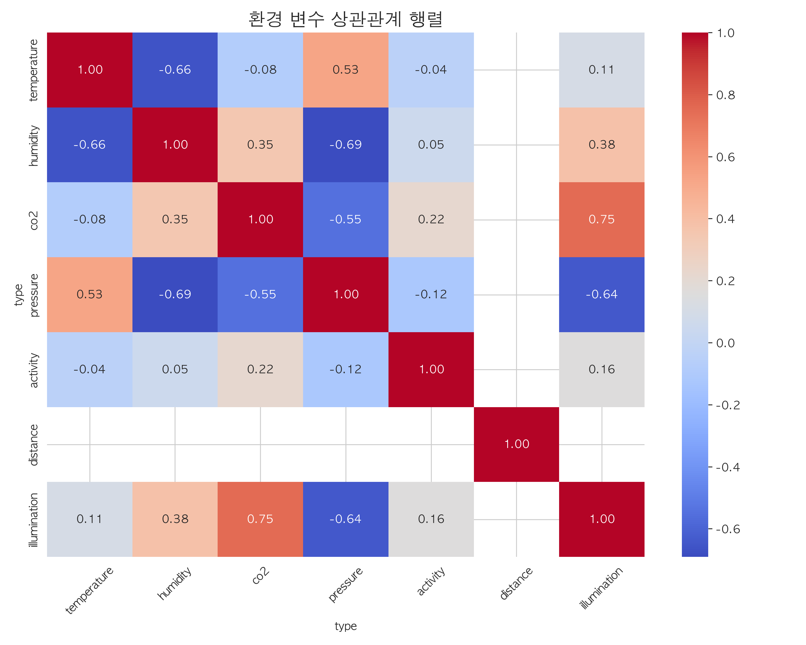
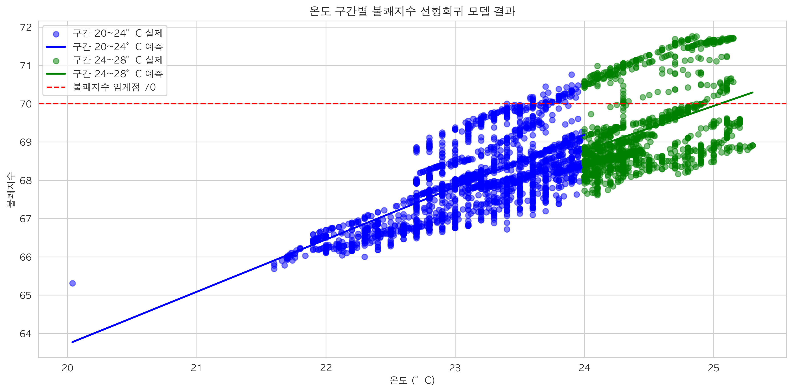
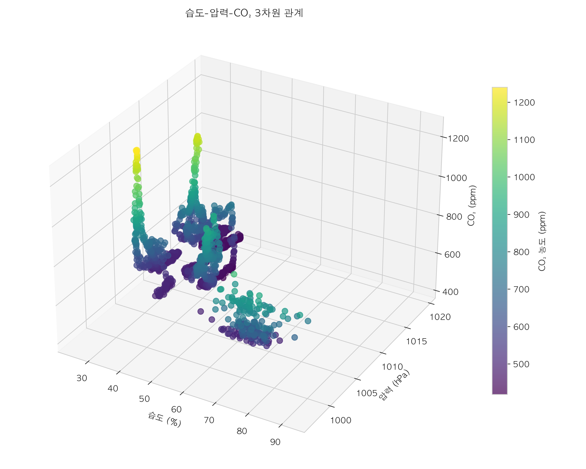

# 변수간 상관 관계

## 환경 변수 상관관계


#### 1. 온도-조도 관계(상관계수 0.96)
- 창가, 자연광이 들어오는 위치에서 온도, 조도 함께 상승
- 조명 기구에서 발생하는 열이 온도에 영향을 미치는 현상

#### 2. 활동량-조도 관계(상관계수 -0.68)
예상과 달리 활동량과 조도 사이에는 상당한 음의 상관관계가 나타남
회의실이나 협업 공간은 조도가 낮게 설정되었으나 활동량은 높음
밝은 공간(예: 창가)에서는 오히려 정적인 활동이 많이 발생
즉, 공부하기 위해 모인 이 학원 공간과 업무하며 컴퓨터를 자주 보는 사무실에서는 조도 역시 중요할 것

#### 3. 활동량-CO2 관계(상관계수 0.38)

예상과 달리 Co2 - 활동량은 강한 상관관계를 보이지 않음 
산점도는 낮은 활동량 구간에서는 분산이 크지만 활동량이 증가할수록(30 이상) Co2 농도가 급격히 상승 


#### 4. 온도-불쾌지수 관계의 구간별 분석

완벽한 선형 관계를 보이는 온도-불쾌지수 그래프에서 특정 임계점을 식별할 필요 존재
- 불쾌지수 70을 넘기는 온도 지점 (약 24°C)
- 온도에 따른 불쾌지수 증가 기울기의 변화 지점

```
from scipy.optimize import curve_fit

# 구간 분할 분석
breaks = [20, 24, 28]  # 초기 분할점
slopes = []
intercepts = []
models = []

for i in range(len(breaks)-1):
    mask = (analysis_df['temperature'] >= breaks[i]) & (analysis_df['temperature'] < breaks[i+1])
    subset = analysis_df[mask]
    
    if len(subset) > 10:  # 최소 데이터 개수 확인
        X = subset[['temperature']]
        y = subset['discomfort_index']
        model = LinearRegression().fit(X, y)
        slopes.append(model.coef_[0])
        intercepts.append(model.intercept_)
        models.append((X, y, model))
    else:
        slopes.append(np.nan)
        intercepts.append(np.nan)
        models.append(None)

print(f'구간별 기울기: {slopes}')
```
결과 : 구간별 기울기: [1.2926167855743458, 1.0059990182958043]
- 20-24°C 구간: 1.29 (온도 1°C 증가 시 불쾌지수 1.29 상승)
- 24-28°C 구간: 1.01 (온도 1°C 증가 시 불쾌지수 1.01 상승)

**모델평가**
20~24°C 구간: R² = 0.8958 (약 90%의 설명력)
24~28°C 구간: R² = 0.7920 (약 79%의 설명력)

높은 온도에서 R2 Score가 떨어지는 이유
- 데이터 분산 증가: 24°C 이상에서는 같은 온도라도 불쾌지수 값이 더 넓은 범위에 분포함(특히 24.5°C 이상에서 뚜렷함)
- 다른 변수의 영향 증가: 고온 영역에서는 온도 외에 습도나 기류 같은 다른 환경 요인이 불쾌지수에 미치는 영향이 상대적으로 커짐
- 비선형성 발생: 온도가 높아질수록 불쾌지수와의 관계가 완전한 선형이 아닐 수 있음

그래프에서 볼 수 있듯이 24~28°C 구간에서 일부 데이터 포인트들이 회귀선에서 더 멀리 떨어져 있으며, 이는 온도만으로 설명할 수 없는 불쾌지수의 변동성이 커졌음을 의미

**인사이트**
- 24°C를 기점으로 온도 상승에 따른 불쾌지수 증가 속도가 22% 감소함 (1.29→1.01)

- 낮은 온도 구간(20~24°C)에서 모델의 예측 정확도가 더 높음

- 불쾌지수 관리를 위해 23.5°C 이하로 온도 유지 필요


#### 5. 습도-압력-CO₂ 관계 ( 상세 분석 )

습도-압력(-0.93), 습도-CO₂(0.44), 압력-CO₂(-0.35)의 삼각 관계
- 습도가 높은 공간에서 CO₂ 농도도 높게 나타남
- 압력이 낮은 공간에서 습도와 CO₂가 모두 높게 나타남
환기 상태, 공기 순환과 관련있을 것

**관계 메커니즘 분석**
- 습도-압력 관계 (-0.93)
기압이 낮아지면 공기의 수분 함유 능력이 증가하여 상대습도가 높아짐
밀폐된 공간에서는 인체 활동으로 인한 수분 발생이 습도를 높이고, 동시에 산소 소비로 인해 미세하게 기압이 감소
3D 그래프에서 볼 수 있듯이, 압력이 998~1000hPa로 낮은 구역에서 습도가 70~90%로 높게 나타남

- 습도-CO₂ 관계 (0.44)
인체 활동은 동시에 수분과 CO₂를 배출하므로, 사람들이 많이 모인 공간에서는 두 변수가 함께 증가
환기가 부족한 공간에서는 수분과 CO₂가 모두 축적되는 경향이 보임
산점도에서 습도가 70% 이상인 구간에서 CO₂ 농도가 700~900ppm으로 상승하는 패턴이 관찰됨

- 압력-CO₂ 관계 (-0.35)
압력이 낮은 공간에서는 환기가 부족한 경우가 많아 CO₂가 축적됨

3D 그래프에서 압력이 낮은 영역(998~1000hPa)에서 CO₂ 농도가 상대적으로 높게(800ppm 이상) 나타남

이 관계는 세 변수 중 가장 약한 상관관계를 보이지만, 여전히 환기 상태를 평가하는 데 유용


## 결론
- 압력이 낮고(998~1000hPa), 습도가 높으며(70% 이상), CO₂ 농도도 높은(800ppm 이상) 구역은 환기가 불충분한 상태로 판단
- 2시간 간격의 정기적 환기 -> Co2 농도 낮추기