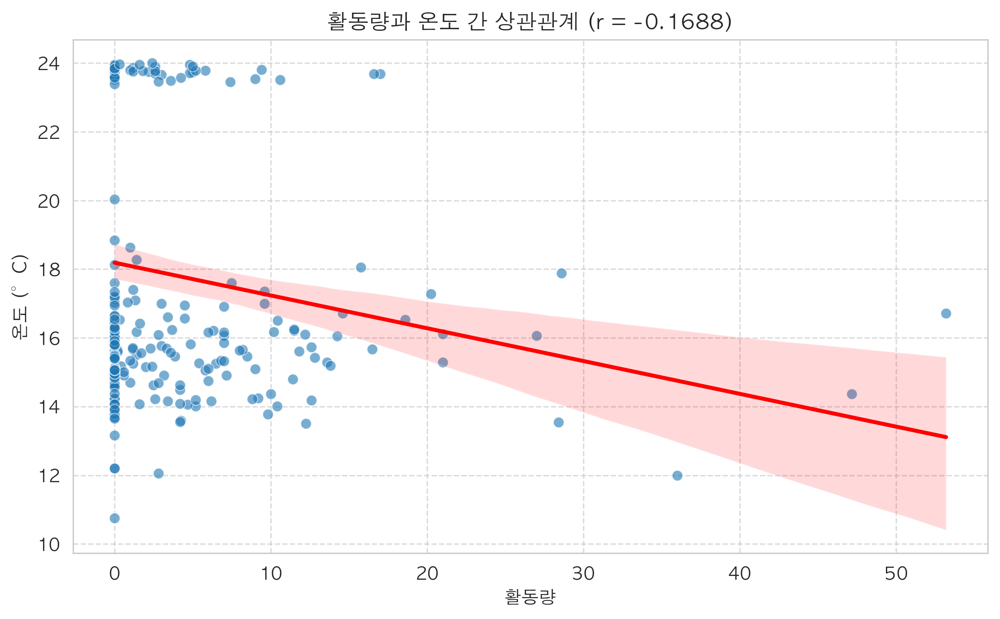
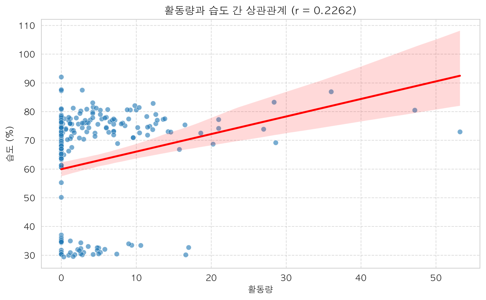
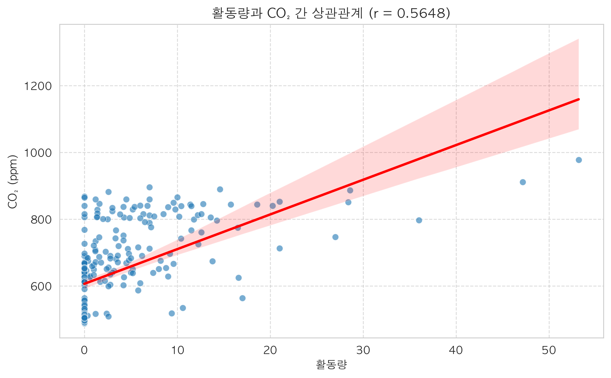
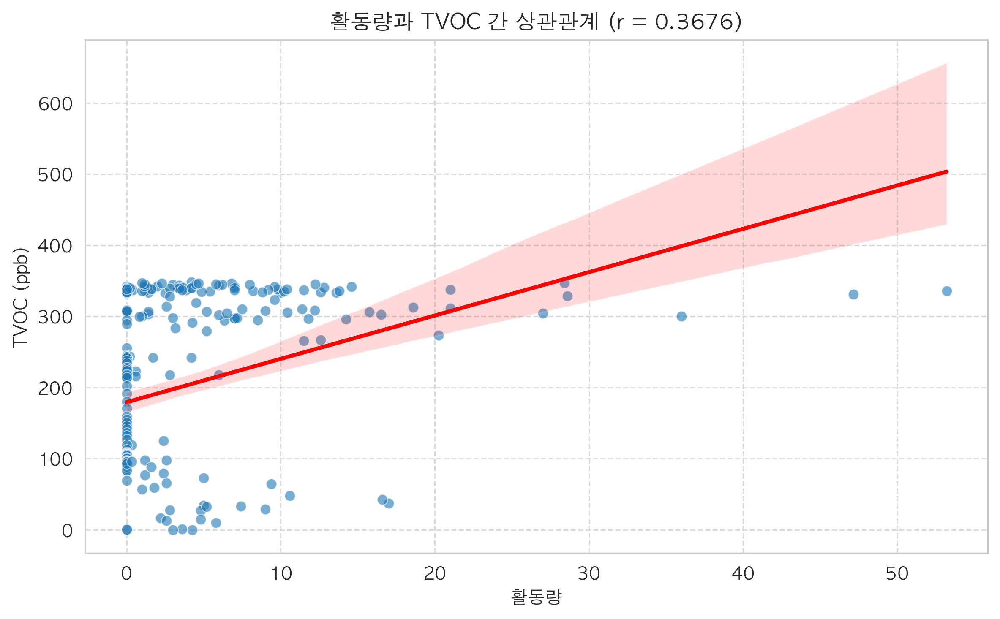
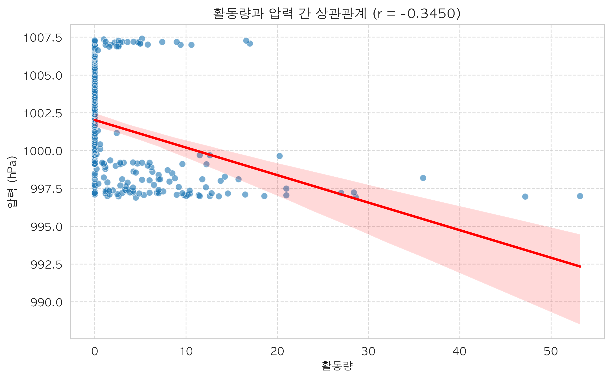

# 활동량과 환경 변수 상관관계 상세 분석 

[ISSUE #66 EDA-5](https://github.com/orgs/Pangyo-Coffee-Legends/projects/4/views/4?pane=issue&itemId=107531970&issue=Pangyo-Coffee-Legends%7Cbacklog%7C66)

## 상관관계 분석 결과


| **환경 변수** | **상관계수** | **관계 강도** | **방향성** |
| --- | --- | --- | --- |
| CO₂ | 0.5648 | 중간 | 양의 상관관계 |
| TVOC | 0.3676 | 중간 | 양의 상관관계 |
| 압력 | -0.3450 | 중간 | 음의 상관관계 |
| 습도 | 0.2262 | 약함 | 양의 상관관계 |
| 온도 | -0.1688 | 약함 | 음의 상관관계 |

### 활동량 - 온도  (-0.1688)

- 분산이 매우큼 
- 낮은 활동량인 0~10 사이에서 온도가 매우 다양하게 분포되어있음

### 활동량 - 습도 (0.2662)

- 습도가 크게 30~35% , 60~90%로 두 클러스터로 나뉘어있음 
- 즉 습도에 영향을 미치는 다른 요인 존재(환기, 위치 등)

### 활동량 - Co2 (0.5648)

- 가장 뚜렷한 선형 관계를 보이며 상대적으로 분산이 적음
- 활동량 증가에 따라 Co2농도가 약 600~1000ppm까지 일관적으로 증가하는 패턴

#### 활동량 - Tvoc(총 휘발성 유기 화합물) (0.3676)

- 중간정도의 분산이 존재, 낮은 활동량에서 350ppb까지 크게 변함 
- 사람이 활동하는 곳이 많은 공간에서는 TVOC를 발생시키는 기구, 소모품, 등이 더 많이 존재할 것으로  추정

#### 활동량 - 압력 (-0.3450)

- 압력 낮은 공간은 환기가 부족해 Co2, 습도 축적되기 쉬움 -> 활동 패턴에 여향 가능성 존재
- 활동량 많을 시 문의 개폐가 빈번해져 압력 변화 발생할 수 있음

- 양방향 인과관계 가능성 존재 

---
## 결론 
즉 환경 변수 간 상호작용: 습도-압력-CO₂ 사이에는 삼각 관계가 존재할 수 있음.
압력이 낮은 공간에서는 환기가 부족하여 CO₂와 습도가 모두 높아질 수 있다. 

EDA-3 변수간 상관관계 분석 보고서 내용 중 
```
-  습도 높은 공간에서는 Co2 농도도 높게 나타남
- 압력 낮은 공간에서 습도, Co2 모두 높게 나타남
-> 환기, 공기순환 관련 존재 
``` 

## CO₂와 TVOC는 활동량과 상당한 관련성
