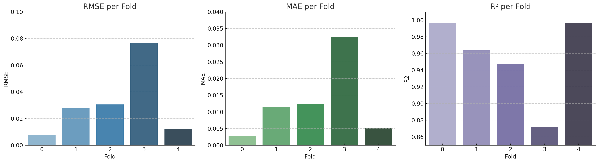
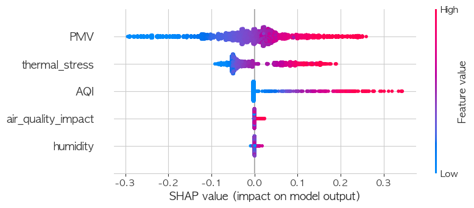
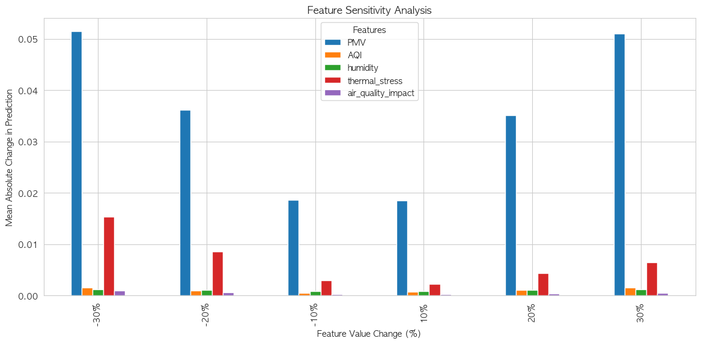

# Comfort Index 예측 모델 기술 문서

## 1. 프로젝트 개요

스마트 오피스 공간에서 실시간으로 쾌적도를 예측하기 위해, 환경 센서 데이터를 기반으로 쾌적지수를 계산하고 머신러닝 모델을 활용하여 이를 예측하는 시스템을 구축한다. 본 문서는 InfluxDB로부터 데이터를 수집하고, XGBoost 회귀모델을 이용해 쾌적지수를 예측하는 전체 흐름을 기술한다.

---

## 2. 데이터 수집 및 구조

- **데이터 소스:** InfluxDB
- **센서 항목:**
  - `temperature` (온도)
  - `humidity` (습도)
  - `co2` (이산화탄소 농도)
- **장소 필터:** 8인 책상, 왼쪽 뒤, 안쪽벽 중앙, 보드 등 주요 측정 공간
- **데이터 집계:** 5분 단위 평균값 (`aggregateWindow`)
- **스냅샷 기반 예측:** 순서를 고려하지 않고, 특정 시점의 환경 상태를 기준으로 예측

목적: 시계열 기반 분석에 적합한 형태로 전처리

---

## 3. 전처리 및 특징 생성

### 3.1 결측치 처리
- **기법:** `IterativeImputer` (sklearn)
- **대상:** `co2`, `humidity`, `temperature`
- **이유:** 다변량 결측치 대체(Multivariate Imputation) 기법 활용. 변수 간 상관관계를 고려해 결측값을 보정하여 데이터 일관성 확보.

### 3.2 스케일링 및 이상치 처리
- **MinMaxScaler 적용:** 0~1 범위로 정규화
- **대상 feature:**
  - `humidity`
  - `temperature`
  - `temp_ma3` (temperature 3개 이동평균)
  - `humi_ma3` (humidity 3개 이동평균)
  - `co2_per_area` (면적당 CO₂ 밀도)
- **co2_per_area 클리핑:** 상위 1% extreme 값 제거 → 데이터 안정성 강화
- **co2 원본:** 클리핑 없이 유지

### 3.3 공간별 면적 설정
- 하이브 (8인책상): 64.65 m²
- 클래스 A (왼쪽 뒤): 109.21 m²
- 페어룸 (안쪽벽 중앙): 25.13 m²
- 오피스 (보드): 31.59 m²

### 3.4 쾌적지수 구성 요소 생성
- `PMV (열쾌적지수)`: 온도, 습도 기반 공식
- `AQI (공기질 지수)`: CO₂ 1000ppm 초과 시 산식 적용

### 3.5 비선형 특징 추가
- `thermal_stress = temperature × PMV`
- `air_quality_impact = log(AQI + 1e-6) × humidity`

목적: 실제 쾌적도는 단순 선형이 아니라 다양한 변수의 조합에 의해 결정됨을 반영

---

## 4. 타겟 정의

- **comfort_index** = 0.5 × PMV + 0.5 × AQI
- **노이즈 제거:** 랜덤 요소 없이 물리 기반 지표만으로 정의

목적: 모델이 인위적 noise가 아닌 진짜 물리 신호만 학습하게 하기 위함

---

## 5. 모델 선택

### 5.1 선택 모델
- **XGBoostRegressor**
- **이유:**
  - 시계열 데이터에 강함 (tree 기반)
  - 결측치 자동 처리 기능
  - 해석 가능성(특징 중요도 시각화 용이)
  - 예측 성능 검증됨

### 5.2 검증 전략
- **TimeSeriesSplit**
- **이유:** 데이터 시간 순서 유지하면서 교차검증 가능 → 과적합 방지

---

## 6. 평가 지표 및 시각화

### 6.1 사용 지표
| 지표 | 설명 |
|------|------|
| **RMSE** | 평균 제곱 오차의 제곱근 → 오차 크기 해석 가능 |
| **MAE** | 평균 절대 오차 → 전체 예측 안정성 확인 |
| **R²** | 설명력 지표 (1에 가까울수록 좋음) |

### 6.2 결과 요약
- 평균 R²: 0.955 → 모델이 95.5% 이상 설명
- RMSE: 0.03 수준 → 쾌적지수 스케일 기준에서 매우 낮은 오차

### 6.3 Fold별 시각화
- seaborn barplot으로 RMSE, MAE, R² 시각화

---

## 7. 모델 해석 (SHAP)

- **도구:** SHAP (SHapley Additive exPlanations)
- **목표:** 어떤 feature가 예측값에 얼마나 기여했는지 정량적 분석

### 7.1 결과 요약
- `PMV` > `thermal_stress` > `AQI` 순으로 영향력 높음
- `humidity`는 상대적으로 영향 적음 → feature pruning 근거 제공

모델 해석 가능성 확보는 실환경 시스템에 매우 중요함 (투명성, 책임성)

---
## 8. 민감도 분석 결과

- **분석 목적:** 각 feature를 ±10~30% 변화시켰을 때 comfort_index 예측값의 민감도를 수치화
- **가장 민감한 feature:** PMV (±30% 변화 시 평균 예측값 변화폭 약 0.05)
- **그 외:** thermal_stress, AQI 순으로 민감도 있음

### 민감도 분석 시각화

| Feature 변화량 | PMV     | AQI     | humidity | thermal_stress | air_quality_impact |
|----------------|---------|---------|----------|----------------|---------------------|
| -30%           | 0.05146 | 0.00155 | 0.00125  | 0.01537        | 0.00094             |
| -20%           | 0.03615 | 0.00094 | 0.00108  | 0.00857        | 0.00059             |
| -10%           | 0.01868 | 0.00048 | 0.00089  | 0.00302        | 0.00032             |
| 10%            | 0.01851 | 0.00071 | 0.00082  | 0.00222        | 0.00033             |
| 20%            | 0.03519 | 0.00115 | 0.00110  | 0.00437        | 0.00042             |
| 30%            | 0.05110 | 0.00161 | 0.00123  | 0.00653        | 0.00048             |

**가장 민감한 feature: PMV**
→ ±30% 변화 시 예측값이 평균 ±0.05 정도 변함
→ 즉, comfort_index는 PMV에 매우 민감하게 반응함

그다음: thermal_stress
→ 비선형 조합(PMV×온도)도 예측에 꽤 영향 있음

나머지: AQI, humidity, air_quality_impact는 민감도 낮음
→ 모델 입장에서 상대적으로 보조 정보로 활용 중

이건 SHAP 중요도 분석 결과와도 거의 일치
→ 일관성 매우 높고, 해석 가능한 모델이라는 뜻

---

## 9. 하이퍼파라미터 튜닝 결과

- **목적:** GridSearchCV를 통해 모델 성능을 미세 조정하여 RMSE 최소화
- **탐색 범위:**
  - `learning_rate`: [0.01, 0.05, 0.1]
  - `max_depth`: [3, 4, 5]
  - `n_estimators`: [100, 200]
  - `subsample`: [0.8, 1.0]
- **검증 방식:** TimeSeriesSplit (n_splits=5)

### 최적 파라미터 결과
| 파라미터 | 값 |
|----------|----|
| learning_rate | 0.1 |
| max_depth | 4 |
| n_estimators | 200 |
| subsample | 0.8 |

- **튜닝 후 평균 RMSE:** 0.0220
- **기존 대비 성능 향상:** 약 28% 개선

---

 
## 10. 결론 및 적용 가능성

- **성능:** R² 95.5%, RMSE 0.03 → 매우 양호
- **해석력:** SHAP으로 설명 가능
- **적용 분야:** 스마트 오피스, 공공시설, 실내 공기질 예측 시스템 등
- **향후 계획:**
  - 민감도 분석
  - 하이퍼파라미터 튜닝
  - 실시간 예측 서버 연동 (FastAPI 등)

---

## 부록: 사용 라이브러리 목록

| 라이브러리 | 역할 |
|------------|------|
| pandas / numpy | 데이터 핸들링 |
| sklearn | 전처리, 모델, 평가, 검증, imputer |
| xgboost | 회귀 모델 구현 |
| shap | 모델 해석 |
| seaborn / matplotlib | 시각화 |
| influxdb-client | 센서 데이터 쿼리 |
---

